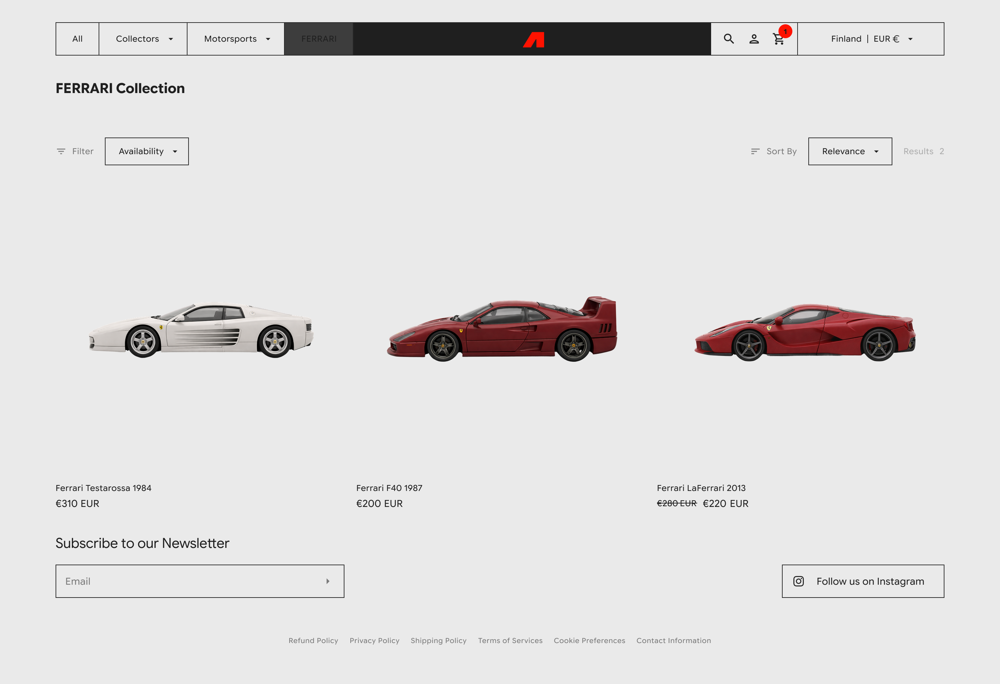

# Altvue

Altvue is a collectible toy e-commerce website built for the Aruna collection. The site presents premium collectible products through a clean storefront experience with collection browsing, product detail pages, search, cart, checkout, account management, newsletter signup, and policy pages.

The app lets users explore curated categories such as all products, collector-focused releases, motorsports models, Batman, Speed Racer, and Ferrari products. Visitors can search products by name or tag, filter results, switch currencies, add items to cart, review checkout totals, and manage a profile with saved delivery addresses.

# Live Demo

[https://arunacollection.vercel.app](https://arunacollection.vercel.app)

# Overview

Altvue was built to turn a collectible toy catalog into a complete online shopping experience. Instead of showing products as a static gallery, the project gives collectors a practical way to browse, compare, search, and prepare purchases from one responsive interface.

The problem it solves is the gap between product presentation and real store behavior. A collectible store needs more than nice images: customers need categories, accurate availability, searchable inventory, clear product pages, cart persistence, checkout pricing, shipping information, account details, and store policies. Altvue brings those pieces together in one polished Next.js application.

# Features

- **Responsive storefront:** A home page with a hero banner, featured product grid, collection entry points, and newsletter signup.
- **Collection browsing:** Dedicated collection pages for All, Classics, Modern, Batman, Speed Racer, and Ferrari products.
- **Product search:** Search results page that matches products by name and tags.
- **Filtering and sorting:** Availability filters, price filters on search results, result counts, removable filter chips, and price sorting from low to high or high to low.
- **Product detail pages:** Product gallery, product name, current price, old price, sold-out state, quantity selector, description, feature list, and add-to-cart overlay.
- **Cart system:** Session-based cart storage with quantity updates, item removal, cart count updates, and cart total calculation.
- **Checkout flow:** Checkout page with cart summary, discount codes, estimated tax, shipping calculation, shipping address fields, saved address selection, billing address option, credit card fields, and PayPal option.
- **User authentication:** Supabase email OTP sign up and sign in flow.
- **Account area:** Profile display/editing, saved addresses, default address handling, address add/edit/delete modals, and an orders tab.
- **Multi-currency support:** Currency selector with searchable country/currency list and client-side price conversion.
- **Newsletter signup:** API route for email subscription storage with validation and duplicate handling.
- **Policy pages:** Refund, privacy, shipping, terms, and cookie policy pages powered by Supabase policy data.
- **Responsive navigation:** Desktop dropdown navigation, mobile menu, search mode, account-aware navigation, route loading overlay, and cart badge updates.
- **Analytics:** Vercel Analytics integration for deployed usage tracking.

# Tech Stack

- **Framework:** Next.js 16 with the App Router
- **UI:** React 19, TypeScript, Tailwind CSS 4
- **Backend/Data:** Supabase database, Supabase Auth, Supabase Storage
- **API:** Next.js route handlers for products, policies, and newsletter subscriptions
- **State:** React state/context, custom cart helpers, sessionStorage cart persistence
- **Images:** Next Image with Supabase remote image support
- **Animation/UX:** Motion dependency, custom loaders, overlays, dropdowns, and modal components
- **Analytics:** Vercel Analytics
- **Tooling:** ESLint 9, TypeScript 5, SVGR for SVG icons, PostCSS, React Compiler, npm
- **Deployment:** Vercel

# What I Built

- Built the project as a full e-commerce storefront instead of a static catalog, including the home page, navigation, collections, product pages, search, cart, checkout, account, and policy routes.
- Designed the interface around a premium collectible shopping experience: dark base styling, strong product imagery, custom typography, compact controls, responsive grids, dropdown navigation, overlays, and consistent icon-based actions.
- Connected the product catalog to Supabase, mapped database rows into frontend product objects, and used Supabase Storage images throughout the product cards, hero section, galleries, and checkout.

- Developed the search and filtering experience with query matching, availability counts, price range filtering, sorting, result totals, and removable filter chips.
- Built reusable UI pieces with an atomic/component structure, including buttons, inputs, chips, product cards, modals, account rows, filter controls, navigation items, and checkout sections.
- Implemented the design-to-development process by breaking the store into repeated patterns first, then converting those patterns into reusable React components so product browsing, search results, collections, cart rows, account cards, and checkout summaries stay visually consistent.

- Implemented cart behavior with sessionStorage persistence, quantity controls, item removal, live cart badge updates, and a product-page added-to-cart overlay.
- Built the checkout experience with saved address loading, manual shipping forms, country-specific shipping details, discount codes, estimated tax, billing address controls, and payment method UI.
- Added Supabase email OTP authentication, account profile editing, saved address management, default address handling, newsletter subscription storage, and dynamic policy pages.

## Getting Started

Clone the project and install dependencies
